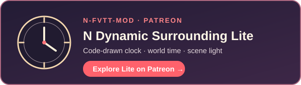

# N Dynamic Surrounding Lite

A lightweight analog clock for Foundry VTT v14. The clock follows world time and reads the current Scene's actual darkness; it does not change Scene darkness or generate weather.

For packages submitted to Foundry VTT's official listing, its AI Content Policy restricts prepared visual assets. Lite therefore renders its clock visuals in code instead of bundling the full edition's illustrated clock faces. For a richer range of clock styles, see the full edition on Patreon. Hand-illustrated clock faces for Lite are also in development.

## Features

- Analog clock and calendar driven by the active world's time.
- A light indicator that follows the current Scene's darkness level.
- Chat messages for calendar transitions and changes in Scene light. PF2E worlds also receive setting-specific month descriptions and named-year messages where available.
- Token vision warnings in dim light and darkness. PF2E uses its native actor vision capabilities; other systems use available token vision modes and optional actor flags.
- Optional emphasis when world time is advanced by a meaningful amount.
- In PF2E, the native Effects Panel can be opened from a compact button below the clock and browsed in a limited-height tray.
- English and Simplified Chinese interface text.

## More Display on Patreon

For more detailed display, you can find the display video on Patreon:

  

## Compatibility

- Foundry VTT: minimum v14; package manifest targets v14.367.
- Game systems: no required system dependency. PF2E-specific calendar text and vision detection are enabled only in PF2E worlds.
- The module has no required third-party module or socket dependency.

## Installation

Before the repository and its `v1.0.0` Release are published, install the supplied ZIP manually as the `n-dynamic-surrounding-lite` module directory and enable it in your world. These planned GitHub addresses become usable after that Release includes both `module.json` and `n-dynamic-surrounding-lite.zip`:

- Repository: https://github.com/N-FVTT-mod/n-dynamic-surrounding-lite
- Foundry manifest URL: https://github.com/N-FVTT-mod/n-dynamic-surrounding-lite/releases/latest/download/module.json
- Version 1.0.0 ZIP: https://github.com/N-FVTT-mod/n-dynamic-surrounding-lite/releases/download/v1.0.0/n-dynamic-surrounding-lite.zip

After publication, paste the manifest URL into Foundry's **Install Module** dialog for an install that can receive future updates. The ZIP link installs this particular Release. The repository must use the account and filename shown above, or the addresses in this README and `module.json` must be updated together.

## Settings

Open **Game Settings → Configure Settings → Module Settings → N Dynamic Surrounding Lite**.

- **Token Vision Warnings** (world): show warnings when the current light level exceeds a token's detected vision capability.
- **Calendar and Light Messages** (world): allow one active GM to post calendar and Scene-light changes to chat. This switch affects both kinds of message.
- **Dock PF2E Effects Below the Clock** (client, PF2E only): place the native Effects Panel in the clock's expandable tray. Enabled by default; changing it requires a reload.
- **Emphasize Time Jumps** (client): animate deliberate advances of world time on this client's clock.
- **Minimum Emphasis Interval** (client): set the minimum time change in seconds that triggers emphasis; the default is 300 seconds.

## Data and removal

The module stores these five settings under `n-dynamic-surrounding-lite`. On non-PF2E systems, a GM may optionally provide actor flags under `n-dynamic-surrounding-lite.vision` with `darkvision` or `lowLightVision` boolean values. It does not write Scene darkness, Actors, Items, or its own weather state. Disabling the module leaves stored settings and optional flags inert; a manual uninstall can leave those harmless values behind.

## Full version

The full **N Dynamic Surrounding** module adds:

- **Intelligent, realistic weather and lighting shaped by the world's climate zones and biomes.**
- **Distinctive artistic clock faces, plus special environments and weather from the Pathfinder setting.**

  

